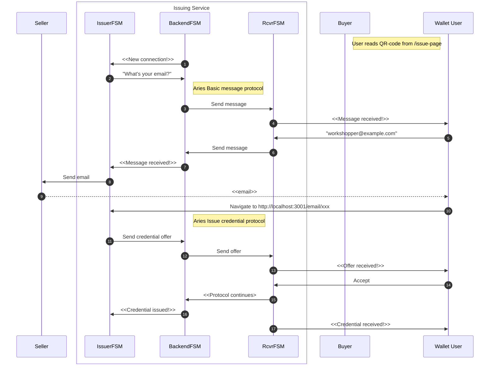

# Readme

This is a brief documentation how to get started with
`issuing-service-?-fsm.ymal` chat bot files. Before we continue here's list of
documents and places that are helpful when playing with these:

1. [FSM documentation part I]()
1. [FSM documentation part II]()
1. [The workshop material for CLI tool]()

## Prerequisites

Note, for now one we assume that reader uses local setup of the agency. That
makes easier to follow core agent's logs in real-time, and some other things.

Even that you have probably cloned the repo this file exists. Do it now:

```shell
git clone https://github.com/findy-network/findy-agent-cli
```

Follow the material in the repo's readme files or the worshop material mentioned
at the beginning to get your `findy-agent-cli` CLI tool working, i.e.,
communicating your agency.

1. Go to repo's root:
1. Less typing and autocompletion:
   ```shell
   alias cli=findy-agent-cli
   source ./scripts/sa-compl.sh
   ```

### Very Important

If you create new wallets directly with the CLI tool, make sure that auto accept
mode is ON for the agent. The check it after the `agent ping` works:

```shell
cli agent mode-cmd -r
```

Result should be: AUTO_ACCEPT. Note, allocation scripts do this automatically.

# Setup Agents And Wallets

You need at least three wallets and their agents up and running. In side the
`findy-agent-cli` repo you have `scrpits/fullstack` directory. Let's name it for
the rest of the documentation a tool root. For example:

```shell
export MY_ROOT=`pwd`
```

Follow the workshop documentation how to allocate new agents with their wallets.

Allocate the following agents:
1. `issuing`, will be the issuing service
1. `seller`, will be a seller, aka logical issuer
1. `buyer`, will be a buyer.
1. `verifier`, will be a verifier.

Here's a example how you could
1. allocate the agents,
1. create schema and credential definition (done in `issuing`),
1. create DIDComm connections between `issuing`, `seller`, and `buyer` *where
   the last is done in this phase just for testing the environment*. During the
   implementation to the app invitation or command to connect with <SessionID>
   is send in own step during the service use.

```shell
cd "$MY_ROOT"
make-play-agent.sh issuing seller buyer verifier
cd play/issuing
source ./new-schema
source ./new-cred-def
./invitation | ../seller/connect
./invitation | ../buyer/connect
```

**Note! Leave this terminal open and do not enter new commands to it yet.**

## Use The Issuing Service

1. open 2 separated terminals (see the workshop material how to init envs) to
   work as `seller`, leave it to be.
1. open 2 separated terminals (see the workshop material how to init envs) to
   work as `buyer`, leave it to be.
1. go back to previous `issuing` terminal and start the chatbot:
   ```shell
   cli bot start --service-fsm issuing-service-b-fsm.yaml issuing-service-f-fsm.yaml -v=1
   ```
1. go back to `seller` terminal A (`cli bot read`) read-only, to responses
1. go back to `seller` terminal B (`cli bot chat`)
    1. optional: enter 'help' to get used to
    1. enter <sessionID>, select something easy
    1. enter <role>, == 'issuer'
    1. enter <attr_data>, select something easy
1. go back to `buyer` terminal A (`cli bot read `) read-only, to responses
1. go back to `buyer` terminal B (`cli bot chat`)
    1. optional: enter 'help' to get used to
    1. enter <sessionID>, select something easy
    1. enter <role>, == 'rcvr'
1. see the both A (bot read) terminals, results should be that the credential is
   issued.
1. go to terminals B and enter something to move FSM instances to start state.
1. optional, you could run it againg whit the same players.

## Sequence Diagram


