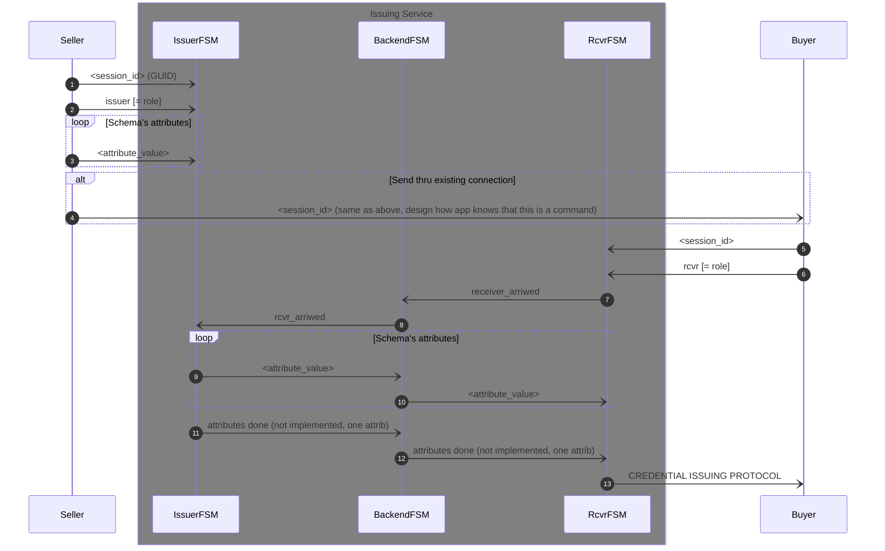

# Readme

This is a brief documentation of how to get started with
`issuing-service-?-fsm.ymal` chatbot files. Before we continue, here's a list of
documents and places that are helpful when playing with these:

1. [Getting Started](https://findy-network.github.io/blog/2023/01/30/getting-started-with-ssi-service-agent-development/)
1. [Writing SSI Apps](https://findy-network.github.io/blog/2023/02/06/how-to-equip-your-app-with-vc-superpowers/)
1. [FSM documentation part I](https://findy-network.github.io/blog/2023/03/13/no-code-ssi-chatbots-fsm-part-i/)
1. [FSM documentation part II](https://findy-network.github.io/blog/2023/06/22/beautiful-state-machines-fsm-part-ii/)
1. [The workshop material for CLI tool](https://github.com/findy-network/agency-workshop/tree/master/track1-cli#task-0-setup-environment)

## Prerequisites

Note, for now, we assume that the reader uses the local setup of the agency.
It makes it easier to follow the core agent's real-time logs.

Even though you have probably cloned the repo. But if not, please do it now:

```shell
git clone https://github.com/findy-network/findy-agent-cli
```

Follow the material in the repo's readme files or the workshop material
mentioned at the beginning to get your `findy-agent-cli` CLI tool working, i.e.,
communicating with your agency.

### Helpers

1. Go to repo's root:
1. Shorter name and autocompletion:
   ```shell
   alias cli=findy-agent-cli
   source ./scripts/sa-compl.sh
   ```

> Document assumes that CLI tool is named to `cli`.

### Very Important

If you create new wallets directly with the CLI tool, make sure that auto-accept
mode is ON for the agent. The check it after the `agent ping` works:

```shell
cli agent mode-cmd -r
```

The result should be AUTO_ACCEPT. Note that allocation scripts do this automatically.

> Chatbots should work even when auto-accept isn't ON.

# Setup Agents And Wallets

It would be best to have at least three wallets and their agents up and running.
Inside the `findy-agent-cli` repo, you have `scrpits/fullstack` directory. Let's
name it a tool root for the rest of the documentation. For example:

```shell
export MY_ROOT=`pwd`
```

Follow the workshop documentation on how to allocate new agents with their wallets.

Allocate the following agents:
1. `issuing` will be the issuing service
1. `seller`, will be a seller, aka logical issuer
1. `buyer` will be a buyer.
1. `verifier` will be a verifier. (Usage is out scoped from this document.)

Here's an example of how you could
1. allocate the agents,
1. have access to FSM files by making links,
1. create schema and credential definition (done in `issuing`),
1. create DIDComm connections between `issuing`, `seller`, and `buyer` *where
   the last is done in this phase just for testing the environment*. During the
   implementation to the app invitation or command to connect with <SessionID>
   is sent in its own step during the service use.

```shell
cd "$MY_ROOT"
make-play-agent.sh issuing seller buyer verifier
cd play/issuing
ln -s ../../fsm/issuing-service-f-fsm.yaml
ln -s ../../fsm/issuing-service-b-fsm.yaml
open `cli bot uml issuing-service-f-fsm.yaml` # UML rendering
source ./new-schema
source ./new-cred-def
./invitation | ../seller/connect
./invitation | ../buyer/connect
```

> **Note! Leave this terminal open and do not enter new commands to it yet.**

## Use The Issuing Service

1. open 2 separated terminals (see the workshop material on how to init envs) to
   work as `seller`, leave it to be.
1. open 2 separated terminals (see the workshop material on how to init envs) to
   work as `buyer`, leave it to be.
1. go back to the previous `issuing` terminal and start the chatbot:
   ```shell
   cli bot start --service-fsm issuing-service-b-fsm.yaml issuing-service-f-fsm.yaml -v=1
   ```
1. go back to `seller` terminal A (`cli bot read`) read-only to responses
1. go back to `seller` terminal B (`cli bot chat`)
    1. optional: enter 'help' to get used to
    1. enter <sessionID>, select something easy
    1. enter <role>, == 'issuer'
    1. enter <attr_data>, select something easy
1. go back to `buyer` terminal A (`cli bot read `) read-only to responses
1. go back to `buyer` terminal B (`cli bot chat`)
    1. optional: enter 'help' to get used to
    1. enter <sessionID>, select something easy
    1. enter <role>, == 'rcvr'
1. see both A (bot read) terminals; the results should be that the credential is
   issued.
1. go to terminal B and enter something to move FSM instances to the start state.
1. It's optional; you could rerun it with the same players.

## Sequence Diagram

Notes about current implementation:
- only one attribute value schema is implemented. Start with that and add
  cases where more attributes can be entered later.
- every message sends a `basic_message` reply, which usually starts with `ACK`. See
  the `YAML` file for more information. The reply messages aren't drawn to the
  sequence diagram below to keep it as simple as possible.
- you can render state machines to UML:
  ```shell
  open `cli bot uml issuing-service-f-fsm.yaml` # give correct FSM file
  ```


